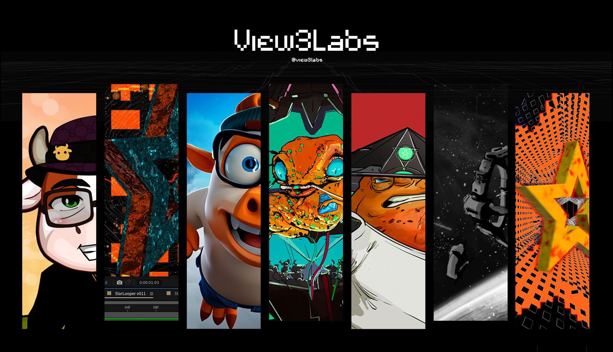

# View3Labs 🌙

**A Web3-native creative studio crafting hand-drawn animated IP, intelligent collectibles, and regenerative ecosystems.**

---

## 🌍 Vision
View3Labs merges creative storytelling with blockchain infrastructure to build decentralized, collaborative, and impact-driven futures. One title. One token. 963 founders.

---

## ⚠️ Contracts
**Nothing is deployed yet. No View3Labs contract is live on any chain**, so anything on-chain claiming to be $VIEW3 or the View3Labs Founder NFT today is fake.

When it is real, here is how you will know:

- The Founder NFT mints on independently audited, battle-tested contracts, and our full mint configuration is published here for anyone to verify before the Genesis mint opens.
- The $VIEW3 token contract follows, with its independent audit report published here before launch.
- The one official contract address is posted in a single channel of our Discord, by the team, nowhere else. The team will never DM you first.

---

## 📂 Key Documents

- [Litepaper](litepaper.md)
- [Roadmap](./docs/roadmap.md)
- [Pitch Deck](./docs/pitch-deck.md)
- [FAQ](./docs/faq.md)
- [Security Policy](./SECURITY.md)
- [Community Guidelines](./CODE_OF_CONDUCT.md)

---

## 🌳 Contributing

This repo is public and open for feedback.  
- Use **Issues** for bugs or questions  
- Use **Discussions** for proposals or community input  

---

## ⚔️ License

- Code: [MIT](LICENSE)  
- Content (docs, images): © View3Labs – All Rights Reserved  

---

## 🔗 Official Links
- Website: [view3labs.com/links](https://view3labs.com/links)  

---

## 🥷 Founded by 

- [@jamiebxrns](https://github.com/jamiebxrns)
